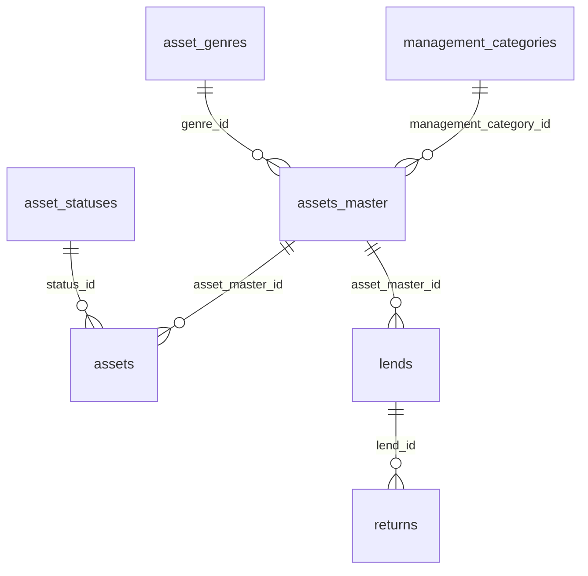

# LIMS v1 DB仕様書

## 1. 文書概要

- 対象DB: `lims_v1`
- 参照元: `lims_v1-init.sql`
- DBMS: MySQL 8.4.7
- 文字コード: `utf8mb4`
- 照合順序: `utf8mb4_0900_ai_ci`
- ストレージエンジン: InnoDB
- ダンプ日時: 2026-02-19 00:45:59

本書は `lims_v1-init.sql` に定義されているDDLと初期データをもとに作成したDB仕様書である。  
業務上の意味づけは、SQLから明確に読み取れる内容を優先し、不明確な点は「推定」として記載する。

## 2. スキーマ概要

### 2.1 テーブル一覧

| テーブル名 | 区分 | 概要 |
| --- | --- | --- |
| `asset_genres` | マスタ | 資産ジャンルを管理する。 |
| `asset_statuses` | マスタ | 資産状態を管理する。 |
| `management_categories` | マスタ | 管理区分を管理する。 |
| `assets_master` | マスタ | 資産台帳の親情報を管理する。 |
| `assets` | トランザクション | 実在する資産または在庫単位の情報を管理する。 |
| `auth_accounts` | 認証 | ログインアカウントを管理する。 |
| `lends` | トランザクション | 貸出情報を管理する。 |
| `returns` | トランザクション | 返却情報を管理する。 |
| `disposals` | トランザクション | 廃棄情報を管理する。 |

### 2.2 リレーション

### 2.3 テーブル間の役割整理

- `assets_master` は資産の基本台帳であり、ジャンルと管理区分を参照する。
- `assets` は `assets_master` に紐づく実資産情報で、状態や設置場所を持つ。
- `lends` は `assets_master` 単位の貸出を記録し、`returns` が返却履歴を保持する。
- `disposals` は管理番号ベースで廃棄履歴を保持する。
- `auth_accounts` は認証用アカウントを持つが、貸出・返却・廃棄の担当者列とは外部キーで結ばれていない。

## 3. テーブル詳細

### 3.1 `asset_genres`

資産ジャンルマスタ。

| カラム名 | 型 | NULL | デフォルト | 制約 | 説明 |
| --- | --- | --- | --- | --- | --- |
| `genre_id` | `int unsigned` | NO | AUTO_INCREMENT | PK | 資産ジャンルID |
| `genre_name` | `varchar(32)` | NO | - | UNIQUE (`ux_genre_name`) | 資産ジャンル名 |
| `genre_code` | `varchar(8)` | NO | - | - | 資産ジャンルコード |
| `is_disabled` | `tinyint(1)` | NO | `0` | - | 無効フラグ |

#### インデックス

- `PRIMARY KEY` (`genre_id`)
- `ux_genre_name` (`genre_name`)

#### 初期データ

| `genre_id` | `genre_name` | `genre_code` | `is_disabled` |
| --- | --- | --- | --- |
| 1 | 個人 | IND | 0 |
| 2 | 事務 | OFS | 0 |
| 3 | ファシリティ | FAC | 0 |
| 4 | 組込みシステム | EMB | 0 |
| 5 | 高度情報演習 | ADV | 0 |
| 6 | テスト | TST | 1 |
| 7 | テスト2 | TST2 | 1 |

### 3.2 `asset_statuses`

資産状態マスタ。

| カラム名 | 型 | NULL | デフォルト | 制約 | 説明 |
| --- | --- | --- | --- | --- | --- |
| `status_id` | `int unsigned` | NO | AUTO_INCREMENT | PK | 資産状態ID |
| `status_name` | `varchar(20)` | NO | - | UNIQUE (`ux_status_name`) | 資産状態名 |
| `is_disabled` | `tinyint` | NO | `0` | - | 無効フラグ |

#### インデックス

- `PRIMARY KEY` (`status_id`)
- `ux_status_name` (`status_name`)

#### 初期データ

| `status_id` | `status_name` | `is_disabled` |
| --- | --- | --- |
| 1 | 正常 | 0 |
| 2 | 故障 | 0 |
| 3 | 修理中 | 0 |
| 4 | 貸出中 | 0 |
| 5 | 廃棄済み | 0 |
| 6 | 紛失 | 0 |

### 3.3 `management_categories`

管理区分マスタ。

| カラム名 | 型 | NULL | デフォルト | 制約 | 説明 |
| --- | --- | --- | --- | --- | --- |
| `management_category_id` | `int unsigned` | NO | AUTO_INCREMENT | PK | 管理区分ID |
| `category_name` | `varchar(20)` | NO | - | UNIQUE (`ux_mgmt_category_name`) | 管理区分名 |

#### インデックス

- `PRIMARY KEY` (`management_category_id`)
- `ux_mgmt_category_name` (`category_name`)

#### 初期データ

| `management_category_id` | `category_name` |
| --- | --- |
| 1 | 個別管理 |
| 2 | 全体管理 |

### 3.4 `assets_master`

資産台帳マスタ。ジャンルと管理区分を持つ親テーブル。

| カラム名 | 型 | NULL | デフォルト | 制約 | 説明 |
| --- | --- | --- | --- | --- | --- |
| `asset_master_id` | `bigint unsigned` | NO | AUTO_INCREMENT | PK | 資産台帳ID |
| `management_number` | `varchar(32)` | NO | - | - | 管理番号 |
| `name` | `varchar(256)` | NO | - | - | 資産名 |
| `management_category_id` | `int unsigned` | NO | - | FK | 管理区分ID |
| `genre_id` | `int unsigned` | NO | - | FK | 資産ジャンルID |
| `manufacturer` | `varchar(128)` | NO | - | - | メーカー名 |
| `model` | `varchar(128)` | YES | `NULL` | - | 型番・モデル名 |
| `created_at` | `timestamp` | NO | `CURRENT_TIMESTAMP` | - | 作成日時 |

#### 外部キー

| 制約名 | カラム | 参照先 | 更新時 | 削除時 |
| --- | --- | --- | --- | --- |
| `assets_master_asset_genres_FK` | `genre_id` | `asset_genres.genre_id` | RESTRICT相当 | RESTRICT相当 |
| `fk_am_category` | `management_category_id` | `management_categories.management_category_id` | RESTRICT | RESTRICT |

#### インデックス

- `PRIMARY KEY` (`asset_master_id`)
- `idx_am_category` (`management_category_id`)
- `idx_am_genre` (`genre_id`)
- `idx_am_created_at` (`created_at`)

### 3.5 `assets`

実資産情報。`assets_master` に紐づく在庫・保有情報を持つ。

| カラム名 | 型 | NULL | デフォルト | 制約 | 説明 |
| --- | --- | --- | --- | --- | --- |
| `asset_id` | `bigint unsigned` | NO | AUTO_INCREMENT | PK | 資産ID |
| `asset_master_id` | `bigint unsigned` | NO | - | FK | 資産台帳ID |
| `serial` | `varchar(64)` | YES | `NULL` | - | シリアル番号 |
| `quantity` | `int unsigned` | NO | `1` | CHECK (`quantity >= 0`) | 数量 |
| `purchased_at` | `date` | NO | - | - | 購入日 |
| `status_id` | `int unsigned` | NO | - | FK | 資産状態ID |
| `owner` | `varchar(128)` | NO | - | - | 所有者 |
| `default_location` | `varchar(128)` | NO | - | - | 既定保管場所 |
| `location` | `varchar(128)` | YES | `NULL` | - | 現在保管場所 |
| `last_checked_at` | `timestamp` | YES | `CURRENT_TIMESTAMP` | - | 最終確認日時 |
| `last_checked_by` | `varchar(64)` | YES | `NULL` | - | 最終確認者 |
| `notes` | `text` | YES | `NULL` | - | 備考 |

#### 外部キー

| 制約名 | カラム | 参照先 | 更新時 | 削除時 |
| --- | --- | --- | --- | --- |
| `fk_assets_master` | `asset_master_id` | `assets_master.asset_master_id` | RESTRICT | RESTRICT |
| `fk_assets_status` | `status_id` | `asset_statuses.status_id` | RESTRICT | RESTRICT |

#### インデックス

- `PRIMARY KEY` (`asset_id`)
- `idx_assets_master_id` (`asset_master_id`)
- `idx_assets_status_id` (`status_id`)
- `idx_assets_location` (`location`)
- `idx_assets_owner` (`owner`)
- `idx_assets_purchased_at` (`purchased_at`)
- `idx_assets_last_checked_at` (`last_checked_at`)

### 3.6 `auth_accounts`

認証アカウント。

| カラム名 | 型 | NULL | デフォルト | 制約 | 説明 |
| --- | --- | --- | --- | --- | --- |
| `id` | `varchar(255)` | NO | - | PK | アカウントID |
| `password_hash` | `varchar(255)` | NO | - | - | パスワードハッシュ |
| `role` | `varchar(64)` | NO | `user` | - | 権限ロール |
| `is_disabled` | `tinyint(1)` | NO | `0` | - | 無効フラグ |
| `created_at` | `datetime(6)` | NO | `CURRENT_TIMESTAMP(6)` | - | 作成日時 |

#### インデックス

- `PRIMARY KEY` (`id`)

### 3.7 `lends`

貸出情報。返却完了状態は `returned` で管理し、詳細な返却履歴は `returns` に保持する。

| カラム名 | 型 | NULL | デフォルト | 制約 | 説明 |
| --- | --- | --- | --- | --- | --- |
| `lend_id` | `bigint unsigned` | NO | AUTO_INCREMENT | PK | 貸出ID |
| `lend_ulid` | `char(26)` | NO | - | UNIQUE (`ux_lend_ulid`) | 貸出識別子 |
| `asset_master_id` | `bigint unsigned` | NO | - | FK | 資産台帳ID |
| `management_number` | `varchar(32)` | YES | `NULL` | - | 管理番号 |
| `quantity` | `int unsigned` | NO | - | CHECK (`quantity > 0`) | 貸出数量 |
| `borrower_id` | `varchar(64)` | NO | - | - | 借受者ID |
| `due_on` | `date` | YES | `NULL` | - | 返却予定日 |
| `lent_by_id` | `varchar(64)` | YES | `NULL` | - | 貸出処理者ID |
| `lent_at` | `timestamp` | NO | `CURRENT_TIMESTAMP` | - | 貸出日時 |
| `note` | `text` | YES | `NULL` | - | 備考 |
| `returned` | `tinyint(1)` | NO | `0` | - | 返却完了フラグ |

#### 外部キー

| 制約名 | カラム | 参照先 | 更新時 | 削除時 |
| --- | --- | --- | --- | --- |
| `fk_lends_asset_master` | `asset_master_id` | `assets_master.asset_master_id` | RESTRICT | RESTRICT |

#### インデックス

- `PRIMARY KEY` (`lend_id`)
- `ux_lend_ulid` (`lend_ulid`)
- `idx_lend_mngnum` (`management_number`)
- `idx_lend_master` (`asset_master_id`)
- `idx_lend_borrower` (`borrower_id`)
- `idx_lend_due` (`due_on`)
- `idx_lend_at` (`lent_at`)

### 3.8 `returns`

返却情報。`lends` に対して複数件紐づく構成。

| カラム名 | 型 | NULL | デフォルト | 制約 | 説明 |
| --- | --- | --- | --- | --- | --- |
| `return_id` | `bigint unsigned` | NO | AUTO_INCREMENT | PK | 返却ID |
| `return_ulid` | `char(26)` | NO | - | UNIQUE (`ux_return_ulid`) | 返却識別子 |
| `lend_id` | `bigint unsigned` | NO | - | FK | 貸出ID |
| `quantity` | `int unsigned` | NO | - | CHECK (`quantity > 0`) | 返却数量 |
| `processed_by_id` | `varchar(64)` | YES | `NULL` | - | 返却処理者ID |
| `returned_at` | `timestamp` | NO | `CURRENT_TIMESTAMP` | - | 返却日時 |
| `note` | `text` | YES | `NULL` | - | 備考 |

#### 外部キー

| 制約名 | カラム | 参照先 | 更新時 | 削除時 |
| --- | --- | --- | --- | --- |
| `fk_returns_lend` | `lend_id` | `lends.lend_id` | RESTRICT | RESTRICT |

#### インデックス

- `PRIMARY KEY` (`return_id`)
- `ux_return_ulid` (`return_ulid`)
- `idx_return_lend` (`lend_id`)

### 3.9 `disposals`

廃棄情報。管理番号単位で廃棄履歴を保持する。

| カラム名 | 型 | NULL | デフォルト | 制約 | 説明 |
| --- | --- | --- | --- | --- | --- |
| `disposal_id` | `bigint unsigned` | NO | AUTO_INCREMENT | PK | 廃棄ID |
| `disposal_ulid` | `char(26)` | NO | - | UNIQUE (`ux_disposal_ulid`) | 廃棄識別子 |
| `management_number` | `varchar(32)` | NO | - | - | 管理番号 |
| `quantity` | `int unsigned` | NO | `1` | CHECK (`quantity > 0`) | 廃棄数量 |
| `disposed_at` | `timestamp` | NO | `CURRENT_TIMESTAMP` | - | 廃棄日時 |
| `reason` | `text` | YES | `NULL` | - | 廃棄理由 |
| `processed_by_id` | `varchar(20)` | NO | - | - | 廃棄処理者ID |

#### インデックス

- `PRIMARY KEY` (`disposal_id`)
- `ux_disposal_ulid` (`disposal_ulid`)
- `idx_management_number` (`management_number`)
- `idx_disposed_at` (`disposed_at`)
- `idx_processed_by` (`processed_by_id`)
- `idx_mngnum_disposedat` (`management_number`, `disposed_at`)

## 4. 制約一覧

### 4.1 主キー

| テーブル名 | 主キー |
| --- | --- |
| `asset_genres` | `genre_id` |
| `asset_statuses` | `status_id` |
| `management_categories` | `management_category_id` |
| `assets_master` | `asset_master_id` |
| `assets` | `asset_id` |
| `auth_accounts` | `id` |
| `lends` | `lend_id` |
| `returns` | `return_id` |
| `disposals` | `disposal_id` |

### 4.2 一意制約

| テーブル名 | 制約内容 |
| --- | --- |
| `asset_genres` | `genre_name` |
| `asset_statuses` | `status_name` |
| `management_categories` | `category_name` |
| `lends` | `lend_ulid` |
| `returns` | `return_ulid` |
| `disposals` | `disposal_ulid` |

### 4.3 CHECK制約

| テーブル名 | 制約名 | 条件 |
| --- | --- | --- |
| `assets` | `chk_assets_quantity_nonneg` | `quantity >= 0` |
| `lends` | `chk_lends_quantity_pos` | `quantity > 0` |
| `returns` | `chk_returns_quantity_pos` | `quantity > 0` |
| `disposals` | `chk_disposals_quantity_pos` | `quantity > 0` |

## 5. 初期データ投入対象

初期データが定義されているのは以下の3テーブルのみ。

- `asset_genres`
- `asset_statuses`
- `management_categories`

その他のテーブルには `lims_v1-init.sql` 上で初期データ投入は行われていない。

## 6. SQLから読み取れる設計上の留意点

- `assets_master.management_number` には一意制約がないため、DBレベルでは重複管理番号を登録できる。
- `auth_accounts.id` と、`lends.borrower_id`、`lends.lent_by_id`、`returns.processed_by_id`、`disposals.processed_by_id` の間に外部キー制約はない。
- `disposals` は `management_number` を保持するが、`assets_master` や `assets` への外部キーは持たない。
- `lends` は `returned` フラグを持ち、`returns` は返却履歴を別管理しているため、アプリケーション側で整合性管理が必要である。
- `assets.quantity` は `0` を許容する。ゼロ在庫を許可する設計である。
- `assets.last_checked_at` は NULL許容だが、デフォルト値は `CURRENT_TIMESTAMP` である。
- `assets_master_asset_genres_FK` は `ON DELETE` / `ON UPDATE` の明示指定がないため、MySQLの既定動作として `RESTRICT` 相当で扱われる。

## 7. 想定業務フローの整理

以下はテーブル構造から読み取れる範囲の推定である。

1. `assets_master` に管理番号・資産名・分類を登録する。
2. 実資産や在庫を `assets` に登録し、状態・保管場所を管理する。
3. 貸出時に `lends` を登録する。
4. 返却時に `returns` を登録し、必要に応じて `lends.returned` を更新する。
5. 廃棄時に `disposals` を登録する。
