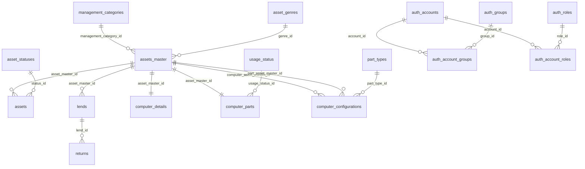

# LIMS v2 DB仕様書

## 1. 文書概要

- 対象DB: `lims_v2`
- 参照元: `lims_v2-init.sql`
- DBMS想定: MySQL 8.4 系
- 文字コード: `utf8mb4`
- 照合順序: `utf8mb4_0900_ai_ci`
- ストレージエンジン: InnoDB
- 作成日: 2026-06-29

本書は `lims_v2-init.sql` に定義したDDLと初期データをもとに作成したDB仕様書である。  
`lims_v1` からの主な差分は、認証系に `auth_groups` / `auth_roles` / `auth_account_groups` / `auth_account_roles` を追加し、単一 `role` 列から多対多の認可モデルへ移行できるようにした点である。

## 2. スキーマ概要

### 2.1 テーブル一覧

| テーブル名 | 区分 | 概要 |
| --- | --- | --- |
| `asset_genres` | マスタ | 資産ジャンルを管理する。 |
| `asset_statuses` | マスタ | 資産状態を管理する。 |
| `management_categories` | マスタ | 管理区分を管理する。 |
| `part_types` | マスタ | 計算機構成で扱う部品種別を管理する。 |
| `usage_status` | マスタ | 計算機部品の利用状態を管理する。 |
| `assets_master` | マスタ | 資産台帳の親情報を管理する。 |
| `assets` | トランザクション | 実在する資産または在庫単位の情報を管理する。 |
| `auth_accounts` | 認証 | ログインアカウントを管理する。 |
| `auth_groups` | 認可マスタ | 所属・業務領域グループを管理する。 |
| `auth_roles` | 認可マスタ | 権限ロールを管理する。 |
| `auth_account_groups` | 認可関連 | アカウントとグループの対応を管理する。 |
| `auth_account_roles` | 認可関連 | アカウントとロールの対応を管理する。 |
| `computer_details` | 付帯情報 | 計算機資産の詳細情報を管理する。 |
| `computer_parts` | 付帯情報 | 計算機部品の詳細情報を管理する。 |
| `computer_configurations` | 付帯情報 | 計算機と部品の構成履歴を管理する。 |
| `lends` | トランザクション | 貸出情報を管理する。 |
| `returns` | トランザクション | 返却情報を管理する。 |
| `disposals` | トランザクション | 廃棄情報を管理する。 |

### 2.2 リレーション

### 2.3 テーブル間の役割整理

- `assets_master` は資産の基本台帳であり、ジャンルと管理区分を参照する。
- `assets` は `assets_master` に紐づく実資産情報で、状態や設置場所を持つ。
- `computer_details` と `computer_parts` は、資産台帳のうち計算機系資産の追加情報を1対1で管理する。
- `computer_configurations` は、計算機本体と部品の組み合わせを履歴として保持する。
- `auth_accounts` は認証情報の保持先であり、`auth_roles` と `auth_groups` が認可情報を分担する。
- `auth_account_roles` により1アカウントへ複数ロールを付与できる。
- `auth_account_groups` により1アカウントへ複数グループを所属させられる。
- `lends` / `returns` / `disposals` は業務履歴を管理するが、担当者ID列は `auth_accounts` と外部キーで結ばれていない。

## 3. テーブル詳細

### 3.1 `asset_genres`

資産ジャンルマスタ。

| カラム名 | 型 | NULL | デフォルト | 制約 | 説明 |
| --- | --- | --- | --- | --- | --- |
| `genre_id` | `int unsigned` | NO | AUTO_INCREMENT | PK | 資産ジャンルID |
| `genre_name` | `varchar(32)` | NO | - | UNIQUE (`ux_genre_name`) | 資産ジャンル名 |
| `genre_code` | `varchar(8)` | NO | - | - | 資産ジャンルコード |
| `is_disabled` | `tinyint(1)` | NO | `0` | - | 無効フラグ |

#### インデックス

- `PRIMARY KEY` (`genre_id`)
- `ux_genre_name` (`genre_name`)

#### 初期データ

| `genre_id` | `genre_name` | `genre_code` | `is_disabled` |
| --- | --- | --- | --- |
| 1 | 個人 | IND | 0 |
| 2 | 事務 | OFS | 0 |
| 3 | ファシリティ | FAC | 0 |
| 4 | 組込みシステム | EMB | 0 |
| 5 | 高度情報演習 | ADV | 0 |
| 6 | テスト | TST | 1 |
| 7 | テスト2 | TST2 | 1 |

### 3.2 `asset_statuses`

資産状態マスタ。

| カラム名 | 型 | NULL | デフォルト | 制約 | 説明 |
| --- | --- | --- | --- | --- | --- |
| `status_id` | `int unsigned` | NO | AUTO_INCREMENT | PK | 資産状態ID |
| `status_name` | `varchar(20)` | NO | - | UNIQUE (`ux_status_name`) | 資産状態名 |
| `is_disabled` | `tinyint` | NO | `0` | - | 無効フラグ |

#### インデックス

- `PRIMARY KEY` (`status_id`)
- `ux_status_name` (`status_name`)

#### 初期データ

| `status_id` | `status_name` | `is_disabled` |
| --- | --- | --- |
| 1 | 正常 | 0 |
| 2 | 故障 | 0 |
| 3 | 修理中 | 0 |
| 4 | 貸出中 | 0 |
| 5 | 廃棄済み | 0 |
| 6 | 紛失 | 0 |

### 3.3 `management_categories`

管理区分マスタ。

| カラム名 | 型 | NULL | デフォルト | 制約 | 説明 |
| --- | --- | --- | --- | --- | --- |
| `management_category_id` | `int unsigned` | NO | AUTO_INCREMENT | PK | 管理区分ID |
| `category_name` | `varchar(20)` | NO | - | UNIQUE (`ux_mgmt_category_name`) | 管理区分名 |

#### インデックス

- `PRIMARY KEY` (`management_category_id`)
- `ux_mgmt_category_name` (`category_name`)

#### 初期データ

| `management_category_id` | `category_name` |
| --- | --- |
| 1 | 個別管理 |
| 2 | 全体管理 |

### 3.4 `part_types`

部品種別マスタ。計算機構成テーブルの部品分類に利用する。

| カラム名 | 型 | NULL | デフォルト | 制約 | 説明 |
| --- | --- | --- | --- | --- | --- |
| `part_type_id` | `int unsigned` | NO | AUTO_INCREMENT | PK | 部品種別ID |
| `name` | `varchar(64)` | NO | - | UNIQUE (`ux_part_type_name`) | 内部コード |
| `display_name` | `varchar(64)` | NO | - | - | 表示名 |
| `note` | `text` | YES | `NULL` | - | 備考 |

#### インデックス

- `PRIMARY KEY` (`part_type_id`)
- `ux_part_type_name` (`name`)

#### 初期データ

| `part_type_id` | `name` | `display_name` |
| --- | --- | --- |
| 1 | motherboard | マザーボード |
| 2 | cpu | CPU |
| 3 | memory | メモリ |
| 4 | gpu | GPU |
| 5 | storage | ストレージ |
| 6 | network_adapter | NIC |
| 7 | other | その他 |

### 3.5 `usage_status`

計算機部品の利用状態マスタ。

| カラム名 | 型 | NULL | デフォルト | 制約 | 説明 |
| --- | --- | --- | --- | --- | --- |
| `usage_status_id` | `int unsigned` | NO | AUTO_INCREMENT | PK | 利用状態ID |
| `name` | `varchar(64)` | NO | - | UNIQUE (`ux_usage_status_name`) | 内部コード |
| `display_name` | `varchar(64)` | NO | - | - | 表示名 |
| `note` | `text` | YES | `NULL` | - | 備考 |

#### インデックス

- `PRIMARY KEY` (`usage_status_id`)
- `ux_usage_status_name` (`name`)

#### 初期データ

| `usage_status_id` | `name` | `display_name` |
| --- | --- | --- |
| 1 | in_use | 使用中 |
| 2 | unused | 未使用 |
| 3 | spare | 予備 |

### 3.6 `assets_master`

資産台帳マスタ。ジャンルと管理区分を持つ親テーブル。

| カラム名 | 型 | NULL | デフォルト | 制約 | 説明 |
| --- | --- | --- | --- | --- | --- |
| `asset_master_id` | `bigint unsigned` | NO | AUTO_INCREMENT | PK | 資産台帳ID |
| `management_number` | `varchar(32)` | NO | - | - | 管理番号 |
| `name` | `varchar(256)` | NO | - | - | 資産名 |
| `management_category_id` | `int unsigned` | NO | - | FK | 管理区分ID |
| `genre_id` | `int unsigned` | NO | - | FK | 資産ジャンルID |
| `manufacturer` | `varchar(128)` | NO | - | - | メーカー名 |
| `model` | `varchar(128)` | YES | `NULL` | - | 型番・モデル名 |
| `created_at` | `timestamp` | NO | `CURRENT_TIMESTAMP` | - | 作成日時 |

#### 外部キー

| 制約名 | カラム | 参照先 | 更新時 | 削除時 |
| --- | --- | --- | --- | --- |
| `assets_master_asset_genres_FK` | `genre_id` | `asset_genres.genre_id` | RESTRICT相当 | RESTRICT相当 |
| `fk_am_category` | `management_category_id` | `management_categories.management_category_id` | RESTRICT | RESTRICT |

#### インデックス

- `PRIMARY KEY` (`asset_master_id`)
- `idx_am_category` (`management_category_id`)
- `idx_am_genre` (`genre_id`)
- `idx_am_created_at` (`created_at`)

### 3.7 `assets`

実資産情報。`assets_master` に紐づく在庫・保有情報を持つ。

| カラム名 | 型 | NULL | デフォルト | 制約 | 説明 |
| --- | --- | --- | --- | --- | --- |
| `asset_id` | `bigint unsigned` | NO | AUTO_INCREMENT | PK | 資産ID |
| `asset_master_id` | `bigint unsigned` | NO | - | FK | 資産台帳ID |
| `serial` | `varchar(64)` | YES | `NULL` | - | シリアル番号 |
| `quantity` | `int unsigned` | NO | `1` | CHECK (`quantity >= 0`) | 数量 |
| `purchased_at` | `date` | NO | - | - | 購入日 |
| `status_id` | `int unsigned` | NO | - | FK | 資産状態ID |
| `owner` | `varchar(128)` | NO | - | - | 所有者 |
| `default_location` | `varchar(128)` | NO | - | - | 既定保管場所 |
| `location` | `varchar(128)` | YES | `NULL` | - | 現在保管場所 |
| `last_checked_at` | `timestamp` | YES | `CURRENT_TIMESTAMP` | - | 最終確認日時 |
| `last_checked_by` | `varchar(64)` | YES | `NULL` | - | 最終確認者 |
| `notes` | `text` | YES | `NULL` | - | 備考 |

#### 外部キー

| 制約名 | カラム | 参照先 | 更新時 | 削除時 |
| --- | --- | --- | --- | --- |
| `fk_assets_master` | `asset_master_id` | `assets_master.asset_master_id` | RESTRICT | RESTRICT |
| `fk_assets_status` | `status_id` | `asset_statuses.status_id` | RESTRICT | RESTRICT |

#### インデックス

- `PRIMARY KEY` (`asset_id`)
- `idx_assets_master_id` (`asset_master_id`)
- `idx_assets_status_id` (`status_id`)
- `idx_assets_location` (`location`)
- `idx_assets_owner` (`owner`)
- `idx_assets_purchased_at` (`purchased_at`)
- `idx_assets_last_checked_at` (`last_checked_at`)

### 3.8 `auth_accounts`

認証アカウント。`role` 列は移行互換のため残している。

| カラム名 | 型 | NULL | デフォルト | 制約 | 説明 |
| --- | --- | --- | --- | --- | --- |
| `id` | `varchar(255)` | NO | - | PK | アカウントID |
| `password_hash` | `varchar(255)` | NO | - | - | パスワードハッシュ |
| `role` | `varchar(64)` | NO | `user` | - | 互換用の単一ロール列 |
| `is_disabled` | `tinyint(1)` | NO | `0` | - | 無効フラグ |
| `created_at` | `datetime(6)` | NO | `CURRENT_TIMESTAMP(6)` | - | 作成日時 |

#### インデックス

- `PRIMARY KEY` (`id`)

### 3.9 `auth_groups`

所属・業務領域グループマスタ。

| カラム名 | 型 | NULL | デフォルト | 制約 | 説明 |
| --- | --- | --- | --- | --- | --- |
| `group_id` | `int unsigned` | NO | AUTO_INCREMENT | PK | グループID |
| `group_code` | `varchar(64)` | NO | - | UNIQUE (`ux_auth_groups_code`) | グループコード |
| `group_name` | `varchar(128)` | NO | - | - | グループ名 |
| `description` | `varchar(255)` | YES | `NULL` | - | 説明 |
| `is_disabled` | `tinyint(1)` | NO | `0` | - | 無効フラグ |
| `created_at` | `datetime(6)` | NO | `CURRENT_TIMESTAMP(6)` | - | 作成日時 |

#### インデックス

- `PRIMARY KEY` (`group_id`)
- `ux_auth_groups_code` (`group_code`)

### 3.10 `auth_roles`

権限ロールマスタ。

| カラム名 | 型 | NULL | デフォルト | 制約 | 説明 |
| --- | --- | --- | --- | --- | --- |
| `role_id` | `int unsigned` | NO | AUTO_INCREMENT | PK | ロールID |
| `role_code` | `varchar(64)` | NO | - | UNIQUE (`ux_auth_roles_code`) | ロールコード |
| `role_name` | `varchar(128)` | NO | - | - | ロール名 |
| `description` | `varchar(255)` | YES | `NULL` | - | 説明 |
| `is_disabled` | `tinyint(1)` | NO | `0` | - | 無効フラグ |
| `created_at` | `datetime(6)` | NO | `CURRENT_TIMESTAMP(6)` | - | 作成日時 |

#### インデックス

- `PRIMARY KEY` (`role_id`)
- `ux_auth_roles_code` (`role_code`)

#### 初期データ

| `role_id` | `role_code` | `role_name` | 説明 |
| --- | --- | --- | --- |
| 1 | user | User | Standard authenticated user |
| 2 | admin | Administrator | Full administrative privilege |

### 3.11 `auth_account_groups`

アカウントとグループの対応テーブル。

| カラム名 | 型 | NULL | デフォルト | 制約 | 説明 |
| --- | --- | --- | --- | --- | --- |
| `account_id` | `varchar(255)` | NO | - | PK/FK | アカウントID |
| `group_id` | `int unsigned` | NO | - | PK/FK | グループID |
| `assigned_at` | `datetime(6)` | NO | `CURRENT_TIMESTAMP(6)` | - | 割当日時 |

#### 外部キー

| 制約名 | カラム | 参照先 | 更新時 | 削除時 |
| --- | --- | --- | --- | --- |
| `fk_aag_account` | `account_id` | `auth_accounts.id` | RESTRICT | RESTRICT |
| `fk_aag_group` | `group_id` | `auth_groups.group_id` | RESTRICT | RESTRICT |

#### インデックス

- `PRIMARY KEY` (`account_id`, `group_id`)
- `idx_aag_group_id` (`group_id`)
- `idx_aag_assigned_at` (`assigned_at`)

### 3.12 `auth_account_roles`

アカウントとロールの対応テーブル。

| カラム名 | 型 | NULL | デフォルト | 制約 | 説明 |
| --- | --- | --- | --- | --- | --- |
| `account_id` | `varchar(255)` | NO | - | PK/FK | アカウントID |
| `role_id` | `int unsigned` | NO | - | PK/FK | ロールID |
| `assigned_at` | `datetime(6)` | NO | `CURRENT_TIMESTAMP(6)` | - | 割当日時 |

#### 外部キー

| 制約名 | カラム | 参照先 | 更新時 | 削除時 |
| --- | --- | --- | --- | --- |
| `fk_aar_account` | `account_id` | `auth_accounts.id` | RESTRICT | RESTRICT |
| `fk_aar_role` | `role_id` | `auth_roles.role_id` | RESTRICT | RESTRICT |

#### インデックス

- `PRIMARY KEY` (`account_id`, `role_id`)
- `idx_aar_role_id` (`role_id`)
- `idx_aar_assigned_at` (`assigned_at`)

### 3.13 `computer_details`

計算機資産の詳細情報。`assets_master` と1対1で対応する。

| カラム名 | 型 | NULL | デフォルト | 制約 | 説明 |
| --- | --- | --- | --- | --- | --- |
| `computer_detail_id` | `bigint unsigned` | NO | AUTO_INCREMENT | PK | 計算機詳細ID |
| `asset_master_id` | `bigint unsigned` | NO | - | UNIQUE/FK | 資産台帳ID |
| `hostname` | `varchar(255)` | YES | `NULL` | - | ホスト名 |
| `ip_address` | `varchar(45)` | YES | `NULL` | - | IPアドレス |
| `mac_address` | `varchar(17)` | YES | `NULL` | - | MACアドレス |
| `os` | `varchar(128)` | YES | `NULL` | - | OS |
| `purpose` | `varchar(255)` | YES | `NULL` | - | 用途 |
| `login_user` | `varchar(128)` | YES | `NULL` | - | 主利用者 |
| `note` | `text` | YES | `NULL` | - | 備考 |
| `created_at` | `datetime` | NO | `CURRENT_TIMESTAMP` | - | 作成日時 |
| `updated_at` | `datetime` | NO | `CURRENT_TIMESTAMP` | - | 更新日時 |

#### 外部キー

| 制約名 | カラム | 参照先 | 更新時 | 削除時 |
| --- | --- | --- | --- | --- |
| `fk_cd_asset_master` | `asset_master_id` | `assets_master.asset_master_id` | RESTRICT | RESTRICT |

#### インデックス

- `PRIMARY KEY` (`computer_detail_id`)
- `ux_cd_asset_master_id` (`asset_master_id`)

### 3.14 `computer_parts`

計算機部品の詳細情報。`assets_master` と1対1で対応する。

| カラム名 | 型 | NULL | デフォルト | 制約 | 説明 |
| --- | --- | --- | --- | --- | --- |
| `computer_part_id` | `bigint unsigned` | NO | AUTO_INCREMENT | PK | 計算機部品ID |
| `asset_master_id` | `bigint unsigned` | NO | - | UNIQUE/FK | 資産台帳ID |
| `usage_status_id` | `int unsigned` | NO | - | FK | 利用状態ID |
| `spec` | `text` | YES | `NULL` | - | 仕様 |
| `note` | `text` | YES | `NULL` | - | 備考 |
| `created_at` | `datetime` | NO | `CURRENT_TIMESTAMP` | - | 作成日時 |
| `updated_at` | `datetime` | NO | `CURRENT_TIMESTAMP` | - | 更新日時 |

#### 外部キー

| 制約名 | カラム | 参照先 | 更新時 | 削除時 |
| --- | --- | --- | --- | --- |
| `fk_cp_asset_master` | `asset_master_id` | `assets_master.asset_master_id` | RESTRICT | RESTRICT |
| `fk_cp_usage_status` | `usage_status_id` | `usage_status.usage_status_id` | RESTRICT | RESTRICT |

#### インデックス

- `PRIMARY KEY` (`computer_part_id`)
- `ux_cp_asset_master_id` (`asset_master_id`)
- `idx_cp_usage_status_id` (`usage_status_id`)

### 3.15 `computer_configurations`

計算機本体と部品の組み合わせ、および構成履歴を管理する。

| カラム名 | 型 | NULL | デフォルト | 制約 | 説明 |
| --- | --- | --- | --- | --- | --- |
| `computer_configuration_id` | `bigint unsigned` | NO | AUTO_INCREMENT | PK | 構成ID |
| `computer_asset_master_id` | `bigint unsigned` | NO | - | FK | 本体の資産台帳ID |
| `part_asset_master_id` | `bigint unsigned` | NO | - | FK | 部品の資産台帳ID |
| `part_type_id` | `int unsigned` | NO | - | FK | 部品種別ID |
| `installed_at` | `date` | YES | `NULL` | - | 取付日 |
| `removed_at` | `date` | YES | `NULL` | - | 取外日 |
| `note` | `text` | YES | `NULL` | - | 備考 |
| `created_at` | `datetime` | NO | `CURRENT_TIMESTAMP` | - | 作成日時 |
| `updated_at` | `datetime` | NO | `CURRENT_TIMESTAMP` | - | 更新日時 |

#### 外部キー

| 制約名 | カラム | 参照先 | 更新時 | 削除時 |
| --- | --- | --- | --- | --- |
| `fk_cc_computer_asset_master` | `computer_asset_master_id` | `assets_master.asset_master_id` | RESTRICT | RESTRICT |
| `fk_cc_part_asset_master` | `part_asset_master_id` | `assets_master.asset_master_id` | RESTRICT | RESTRICT |
| `fk_cc_part_type` | `part_type_id` | `part_types.part_type_id` | RESTRICT | RESTRICT |

#### インデックス

- `PRIMARY KEY` (`computer_configuration_id`)
- `idx_cc_computer_asset_master_id` (`computer_asset_master_id`)
- `idx_cc_part_asset_master_id` (`part_asset_master_id`)
- `idx_cc_part_type_id` (`part_type_id`)
- `idx_cc_active_part` (`part_asset_master_id`, `removed_at`)
- `idx_cc_computer_part_type` (`computer_asset_master_id`, `part_type_id`, `removed_at`)

### 3.16 `lends`

貸出情報。返却完了状態は `returned` で管理し、詳細な返却履歴は `returns` に保持する。

| カラム名 | 型 | NULL | デフォルト | 制約 | 説明 |
| --- | --- | --- | --- | --- | --- |
| `lend_id` | `bigint unsigned` | NO | AUTO_INCREMENT | PK | 貸出ID |
| `lend_ulid` | `char(26)` | NO | - | UNIQUE (`ux_lend_ulid`) | 貸出識別子 |
| `asset_master_id` | `bigint unsigned` | NO | - | FK | 資産台帳ID |
| `management_number` | `varchar(32)` | YES | `NULL` | - | 管理番号 |
| `quantity` | `int unsigned` | NO | - | CHECK (`quantity > 0`) | 貸出数量 |
| `borrower_id` | `varchar(64)` | NO | - | - | 借受者ID |
| `due_on` | `date` | YES | `NULL` | - | 返却予定日 |
| `lent_by_id` | `varchar(64)` | YES | `NULL` | - | 貸出処理者ID |
| `lent_at` | `timestamp` | NO | `CURRENT_TIMESTAMP` | - | 貸出日時 |
| `note` | `text` | YES | `NULL` | - | 備考 |
| `returned` | `tinyint(1)` | NO | `0` | - | 返却完了フラグ |

#### 外部キー

| 制約名 | カラム | 参照先 | 更新時 | 削除時 |
| --- | --- | --- | --- | --- |
| `fk_lends_asset_master` | `asset_master_id` | `assets_master.asset_master_id` | RESTRICT | RESTRICT |

#### インデックス

- `PRIMARY KEY` (`lend_id`)
- `ux_lend_ulid` (`lend_ulid`)
- `idx_lend_mngnum` (`management_number`)
- `idx_lend_master` (`asset_master_id`)
- `idx_lend_borrower` (`borrower_id`)
- `idx_lend_due` (`due_on`)
- `idx_lend_at` (`lent_at`)

### 3.17 `returns`

返却情報。`lends` に対して複数件紐づく構成。

| カラム名 | 型 | NULL | デフォルト | 制約 | 説明 |
| --- | --- | --- | --- | --- | --- |
| `return_id` | `bigint unsigned` | NO | AUTO_INCREMENT | PK | 返却ID |
| `return_ulid` | `char(26)` | NO | - | UNIQUE (`ux_return_ulid`) | 返却識別子 |
| `lend_id` | `bigint unsigned` | NO | - | FK | 貸出ID |
| `quantity` | `int unsigned` | NO | - | CHECK (`quantity > 0`) | 返却数量 |
| `processed_by_id` | `varchar(64)` | YES | `NULL` | - | 返却処理者ID |
| `returned_at` | `timestamp` | NO | `CURRENT_TIMESTAMP` | - | 返却日時 |
| `note` | `text` | YES | `NULL` | - | 備考 |

#### 外部キー

| 制約名 | カラム | 参照先 | 更新時 | 削除時 |
| --- | --- | --- | --- | --- |
| `fk_returns_lend` | `lend_id` | `lends.lend_id` | RESTRICT | RESTRICT |

#### インデックス

- `PRIMARY KEY` (`return_id`)
- `ux_return_ulid` (`return_ulid`)
- `idx_return_lend` (`lend_id`)

### 3.18 `disposals`

廃棄情報。管理番号単位で廃棄履歴を保持する。

| カラム名 | 型 | NULL | デフォルト | 制約 | 説明 |
| --- | --- | --- | --- | --- | --- |
| `disposal_id` | `bigint unsigned` | NO | AUTO_INCREMENT | PK | 廃棄ID |
| `disposal_ulid` | `char(26)` | NO | - | UNIQUE (`ux_disposal_ulid`) | 廃棄識別子 |
| `management_number` | `varchar(32)` | NO | - | - | 管理番号 |
| `quantity` | `int unsigned` | NO | `1` | CHECK (`quantity > 0`) | 廃棄数量 |
| `disposed_at` | `timestamp` | NO | `CURRENT_TIMESTAMP` | - | 廃棄日時 |
| `reason` | `text` | YES | `NULL` | - | 廃棄理由 |
| `processed_by_id` | `varchar(20)` | NO | - | - | 廃棄処理者ID |

#### インデックス

- `PRIMARY KEY` (`disposal_id`)
- `ux_disposal_ulid` (`disposal_ulid`)
- `idx_management_number` (`management_number`)
- `idx_disposed_at` (`disposed_at`)
- `idx_processed_by` (`processed_by_id`)
- `idx_mngnum_disposedat` (`management_number`, `disposed_at`)

## 4. 制約一覧

### 4.1 主キー

| テーブル名 | 主キー |
| --- | --- |
| `asset_genres` | `genre_id` |
| `asset_statuses` | `status_id` |
| `management_categories` | `management_category_id` |
| `part_types` | `part_type_id` |
| `usage_status` | `usage_status_id` |
| `assets_master` | `asset_master_id` |
| `assets` | `asset_id` |
| `auth_accounts` | `id` |
| `auth_groups` | `group_id` |
| `auth_roles` | `role_id` |
| `auth_account_groups` | `account_id`, `group_id` |
| `auth_account_roles` | `account_id`, `role_id` |
| `computer_details` | `computer_detail_id` |
| `computer_parts` | `computer_part_id` |
| `computer_configurations` | `computer_configuration_id` |
| `lends` | `lend_id` |
| `returns` | `return_id` |
| `disposals` | `disposal_id` |

### 4.2 一意制約

| テーブル名 | 制約内容 |
| --- | --- |
| `asset_genres` | `genre_name` |
| `asset_statuses` | `status_name` |
| `management_categories` | `category_name` |
| `part_types` | `name` |
| `usage_status` | `name` |
| `auth_groups` | `group_code` |
| `auth_roles` | `role_code` |
| `computer_details` | `asset_master_id` |
| `computer_parts` | `asset_master_id` |
| `lends` | `lend_ulid` |
| `returns` | `return_ulid` |
| `disposals` | `disposal_ulid` |

### 4.3 CHECK制約

| テーブル名 | 制約名 | 条件 |
| --- | --- | --- |
| `assets` | `chk_assets_quantity_nonneg` | `quantity >= 0` |
| `lends` | `chk_lends_quantity_pos` | `quantity > 0` |
| `returns` | `chk_returns_quantity_pos` | `quantity > 0` |
| `disposals` | `chk_disposals_quantity_pos` | `quantity > 0` |

## 5. 初期データ投入対象

初期データが定義されているのは以下の6テーブルである。

- `asset_genres`
- `asset_statuses`
- `management_categories`
- `part_types`
- `usage_status`
- `auth_roles`

`auth_groups` は組織依存の値になりやすいため、`lims_v2-init.sql` では初期投入していない。

## 6. SQLから読み取れる設計上の留意点

- `auth_accounts.role` は互換用に残している。新しい認可判定は `auth_account_roles` を優先する前提である。
- `auth_account_groups` と `auth_account_roles` により、1アカウントへ複数グループ・複数ロールを割り当てられる。
- `auth_roles` は権限単位、`auth_groups` は所属・業務領域単位として分離しているが、権限詳細の粒度はアプリケーション実装側で定義が必要である。
- `auth_accounts.id` と、`lends.borrower_id`、`lends.lent_by_id`、`returns.processed_by_id`、`disposals.processed_by_id` の間に外部キー制約はない。
- `disposals.processed_by_id` は `varchar(20)`、`auth_accounts.id` は `varchar(255)` であり、将来的に外部キー化するには型統一が必要である。
- `assets_master.management_number` には一意制約がないため、DBレベルでは重複管理番号を登録できる。
- `disposals` は `management_number` を保持するが、`assets_master` や `assets` への外部キーは持たない。
- `lends` は `returned` フラグを持ち、`returns` は返却履歴を別管理しているため、アプリケーション側で整合性管理が必要である。
- `computer_details` と `computer_parts` は `asset_master_id` に一意制約があるため、各資産に対し1件までしか登録できない。

## 7. 想定運用フロー

1. `assets_master` に管理番号・資産名・分類を登録する。
2. 実資産や在庫を `assets` に登録し、状態・保管場所を管理する。
3. 計算機系資産であれば、必要に応じて `computer_details` / `computer_parts` / `computer_configurations` を登録する。
4. アカウントを `auth_accounts` に登録し、権限を `auth_account_roles`、所属を `auth_account_groups` に登録する。
5. 貸出時に `lends` を登録する。
6. 返却時に `returns` を登録し、必要に応じて `lends.returned` を更新する。
7. 廃棄時に `disposals` を登録する。
